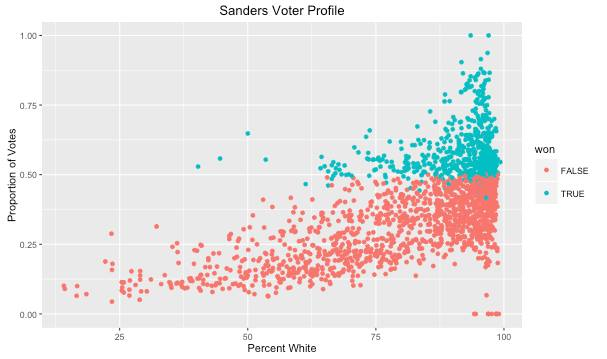
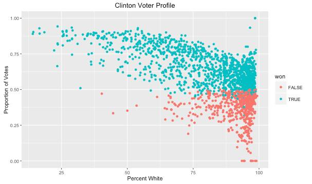
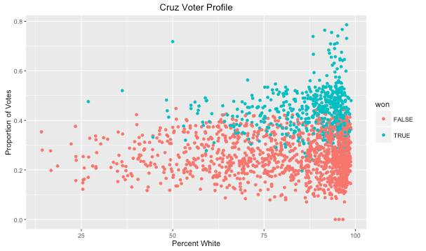
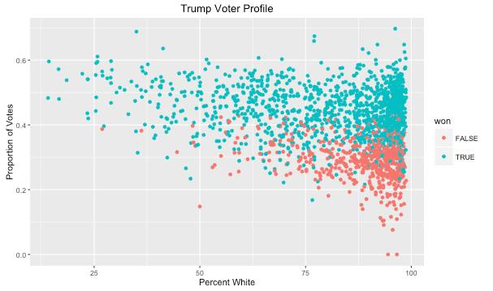
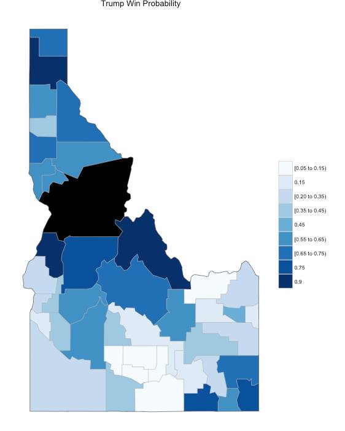
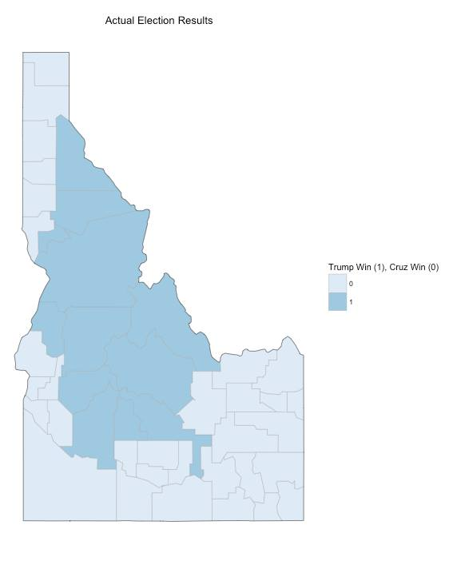

## Question

We decided to do our project on a topic that is especially relevant to the current social and political landscape in the US and worked with 2016 election data. The question we would like to answer is:  

- How can we predict the results for a certain county and what are the most important variables that campaign teams need to look at when canvassing new counties?
- Where should a campaign team put its resources to swing toss up counties?

## Data Set and Methods
*Data*  
We found the data set on Kaggle and it covers the 2016 primary elections. We have found that the variables of interest are demographic data and the number of votes each candidate received. The data is relates to 2016 election data and demographic data from  the census.  
  
*Methods*  
Methods that we learned in this class include data wrangling and linear regression to find the most relevant variables to make predictions. We used the K nearest neighbors and mapping in R to predict the county results and create images of the states.

*Analysis*  
We used linear regression to determine features with high weights. Those features (including race and household population) were used in KNN. Cutting down the featureset avoided high-dimensionality problems. 

*Results*  
From the scatterplots we can see that both Clinton and Trump dominate in counties with a high percentage of non-white voters. These plots were a motivation for using race as a predictor.

With race as the features, the machine learning predicted Idaho fairly well. Trump was predicted to win in most of Central Idaho, and Cruz near the borders. This is clearly reflected in the actual data -- Trump in the center and Cruz on the edges. 

*Linear Regression and KNN was a good model for the data.*  

## Plots
The scatter plots show that Sanders does well in counties with a high percentage of white voters.  

## Results

